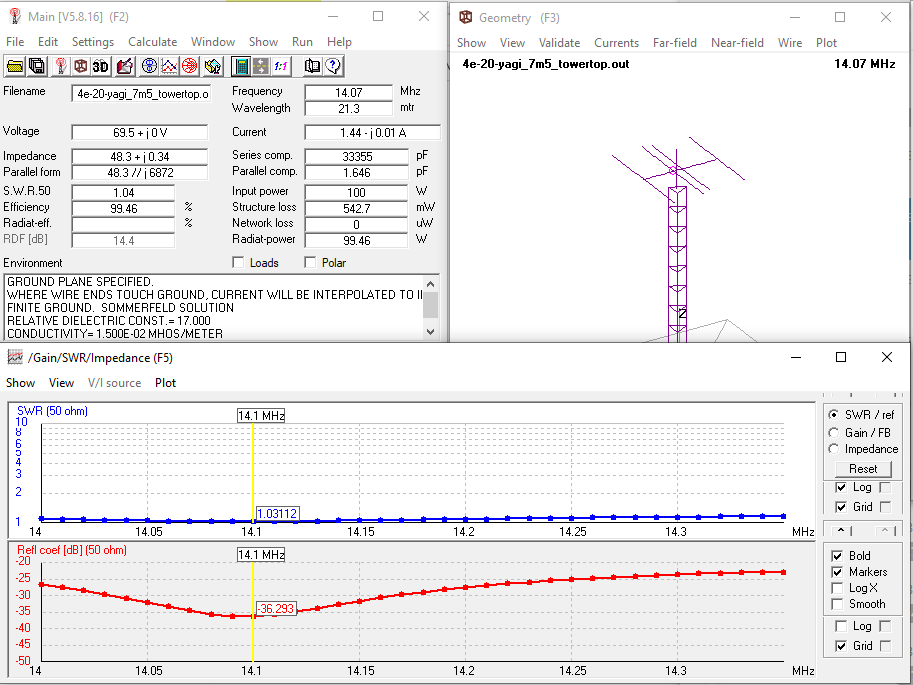

# 4 Elements Fullsize Yagi Antenna for 20m Band (7.5 m boomlength)
Here is presented a model of 4 elements fullsize yagi antenna for 20m band.
The model is optimized for the **boomlength of 7.5 meters** while keep maintain good **VSWR < 1:1.2 throughout 20m band**, gain, and F/B ratio. These can be achieved by using 3 elements basic model and adding a director which is closely coupled to the driven element. This added director actually become the first director. With this arrangement, the first director will resonates at the upper portion of the band while the driven element itself resonates at the lower portion of the band instead. Therefore, actually this is 3 element yagi with extra "driven element". The model is simulated for the installation height of 24 meters using 4nec-2 software package.

## Dimensions
The picture below will tell thousands words. Please left click / right click + open in new tab for the full view of the picture.

|**Parameters**          |**Model 1**      |**Model 2**      |
|:----------------------:|:---------------:|:---------------:|
|**Boomlength**          | 16 m            | 17 m            |
|**Ref - Driven**        | 7.36 m          | 9.76 m          |
|**Driven - Director**   | 8.64 m          | 7.24 m          |
|**Ref (fullsize)**      | 22.63 m         | 21.23 m         |
|**Driven (fullsize)**   | 20.96 m (adjust)| 20.87 m (adjust)|
|**Director (fullsize)** | 19.41 m         | 18.86  m        |
|**tip diameter**        | 6 mm (1/4 inch) | 6 mm (1/4 inch) |
|**center diameter**     | 5 cm (2 inch)   | 5 cm (2 inch)   |
|**boom diameter**       | 5 cm (2 inch)   | 5 cm (2 inch)   |

### About The Telescopic Element sizing
Each of the element is constructed and simulated as a telescopic alumunium tubing. Telescopic taper sizing is considered as **1 inch dia. alu. tubing at the center and 3/8 inch dia. alu. tubing at the tip** Taper schedule from the center to the tip can be adjusted to the alu. tubing dia. which can be purchased locally.
**The models are correct only for the taper sizing mentioned above. If you, for example, want to swap the taper sizing with another size, the model still can be constructed and be adjusted to your working freq but will not deliver the performances predicted in my model.**

### Tuning procedure:
* Mount the antenna at the real installation height.
* **USE A GOOD 1:1 BALUN or CHOKE BALUN** at the feed point.
* Do the tuning procedure using Antenna Analyzer or SWR Analyzer using 50 Ohm Coax as short & practical as possible. Here, you want to eliminates tuning error caused by the long coax. Therefore, use a short coax.
* Tune the driven element for the lowest VSWR at 14.05 MHz and tune the first director for the lowest VSWR at 14.25 MHz. Adjust both end simultaneously.

### Typical VSWR:
(derived from simulation)

|**Parameters**          |**Model 1**|**Model 2**|
|:----------------------:|:---------:|:---------:|
|**@7.0 MHz**            | 1:1.4     | 1:1.4     |
|**@7.1 MHz**            | 1:1.3     | 1:1.15    |
|**@7.2 MHz**            | 1:1.6     | 1:1.38    |
|**VSWR Bandwidth 1:1.5**| 190 kHz   | 250 kHz   |

### Typical Gain and F/B
* **Forward Gain**: 13.9 dBi nominal
* **F/B**: 22 dB nominal
* **3 dB beamwidth**: 66 degrees nominal
* **RDF**: 14 dB nominal

## Simulation Results

## Propagation Map Simulation (VOACAP Online, Oct 2019 at 20 UTC, 80 W of transmit power)

## Contributing
1. Fork it [https://github.com/handiko/4E-20M-YAGI/fork](https://github.com/handiko/4E-20M-YAGI/fork)
2. Create new branch (`git checkout -b myfeature`)
3. Do some editing / create new feature
4. Commit your works (`git commit -m "Adding some myfeature blah blah.."`)
5. Push to the branch (`git push -u origin myfeature`)
6. Create a new Pull Request
